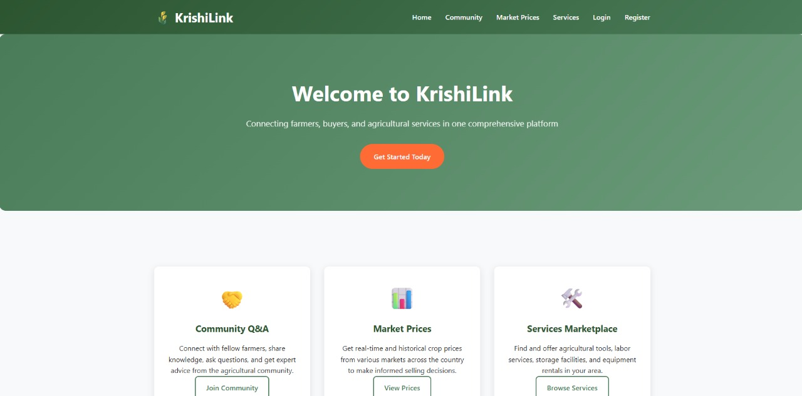
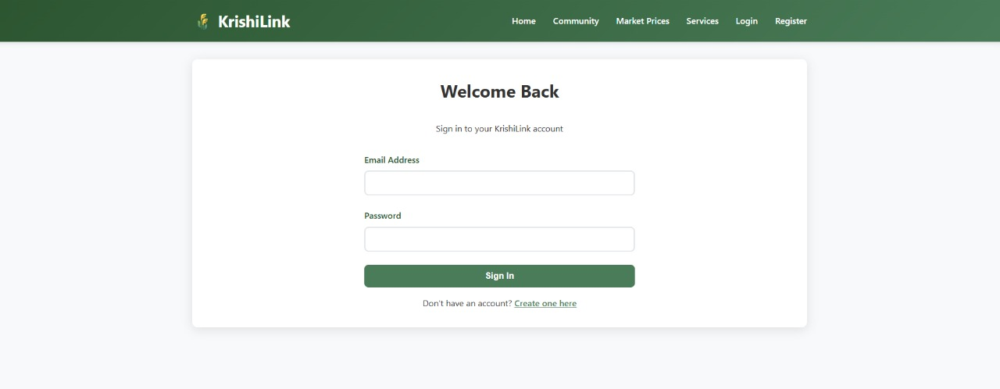
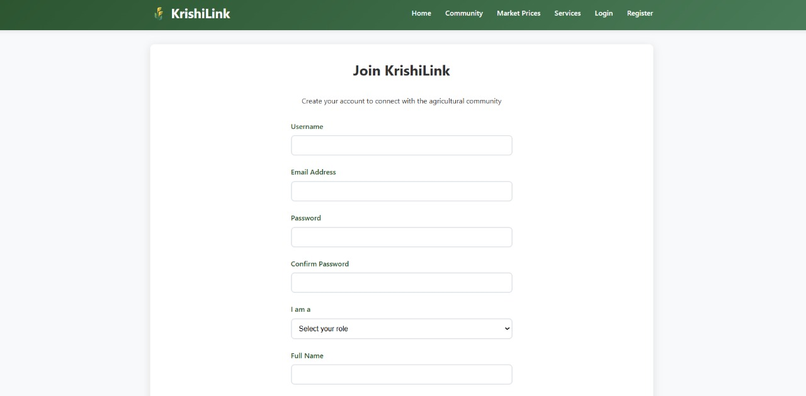
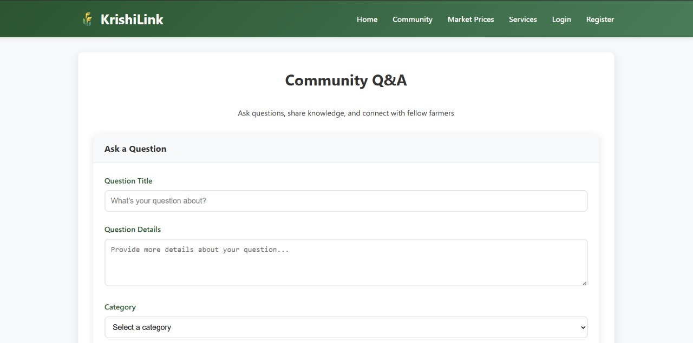
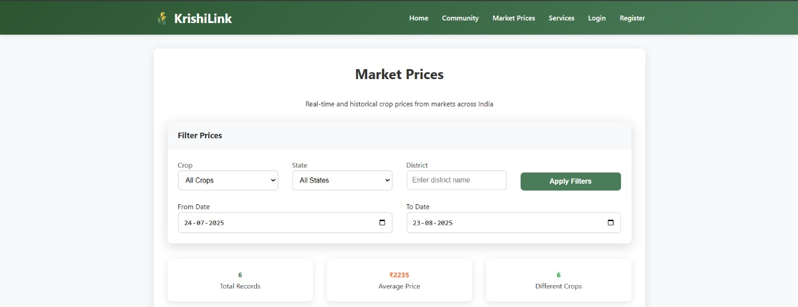
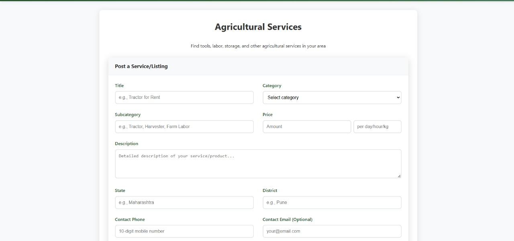
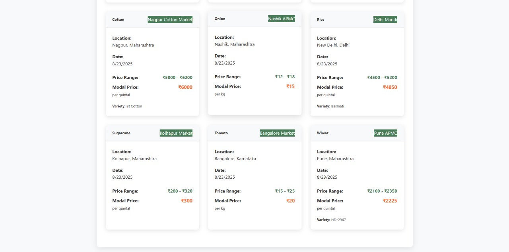
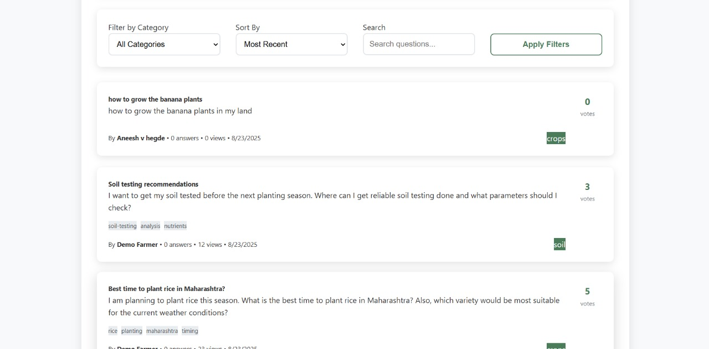
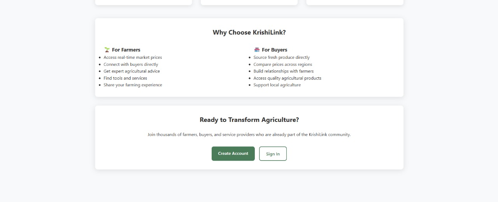

# KrishiLink – A Platform Connecting Farmers, Buyers, and Agricultural Services

**CodeFury 8.0 Hackathon, UVCE College**

KrishiLink is a web platform designed to empower Indian farmers by providing transparent crop pricing, direct buyer-seller connections, agricultural services listings, and community Q&A. It integrates a clean, responsive frontend with a robust Node.js and MongoDB backend — featuring session-based authentication, secure data handling, and REST APIs.

## Project Overview

KrishiLink is an integrated digital marketplace and community platform designed to streamline agricultural trade and services. It connects farmers, buyers, and agricultural service providers within a user-friendly web application, empowering stakeholders to transact transparently, access real-time market information, and leverage community knowledge.

### Key Features

- **Responsive Multi-page Frontend** with modern HTML5 and CSS3 (Flexbox/Grid)  
- **User Authentication**: Secure session-based login/registration for farmers, buyers  
- **Community Q&A**: Platform for asking and answering agricultural questions  
- **Live Crop Pricing**: Timely market price display using cards and tables  
- **Listings Management**: CRUD operations for crops, tools, labor, and storage services  
- **Image & File Upload**: Support for product and service listings  
- **RESTful API Backend** built with Node.js, Express.js, and TypeScript  
- **MongoDB + Mongoose** for scalable data storage  
- **Authentication Security** using Passport.js (Local Strategy) and bcrypt  
- **Input Validation** using Joi for robust data integrity  
- **Static Frontend Files Served via Express** for ease of deployment  
- **Clean Navigation** with consistent header/footer and relative linking  
- **Modular Codebase** designed for scalability and further extension  

### Benefits

- Reduced information asymmetry between farmers and buyers  
- Transparent and fair pricing for agricultural products  
- Easy access to agricultural tools, labor, and storage service listings  
- A collaborative platform enabling farmers to share knowledge and resolve issues  
- Secure, scalable, and maintainable codebase suitable for production use  

---

## Technology Stack

| Layer            | Technology                   | Description                                      |
|------------------|-----------------------------|------------------------------------------------|
| **Frontend**     | HTML5, CSS3 with Flexbox/Grid | Clean and responsive static multi-page design  |
|                  | Minimal JavaScript             | Basic validation and interactivity              |
| **Backend**      | Node.js, Express.js           | REST API server with TypeScript optional        |
|                  | Passport.js (Local Strategy)  | Secure session-based authentication              |
|                  | Multer                       | Handling file and image uploads                   |
|                  | Joi                          | Input validation and sanitization                 |
| **Database**     | MongoDB, Mongoose             | Schema-based NoSQL database                       |
| **Deployment**   | Railway / Heroku / VPS        | Cloud hosting with static file serving            |

---

## Architecture Overview

- **Frontend**:  
  Multi-page static site (home, login, register, community Q&A, pricing, services) served as static files from backend using `express.static()`.  
  Navigation uses relative links maintained via consistent header/footer components.

- **Backend REST API**:  
  Handles authentication, Q&A CRUD, marketplace listings CRUD, and crop pricing endpoints.  
  Includes secure session management with Passport.js and bcrypt password hashing.

- **Database**:  
  MongoDB stores users, listings, questions, answers, and pricing data.  
  Mongoose schemas enforce data models with validation using Joi.

- **Deployment**:  
  The Node.js server hosts APIs and static frontend, deployable on cloud platforms with environment variable configuration for secrets and database connectivity.

---

This modular architecture ensures scalability, security, and maintainability, making KrishiLink a robust solution for agricultural marketplace needs.

## Screenshots & Demo Walkthrough

### 1. Landing Page (home.html)
Welcome page showcasing platform features, benefits, and quick navigation.

---

### 2. User Authentication
Clean login and registration forms supporting secure farmer and buyer access.

  

---

### 3. Community Q&A (community.html)
Interactive Q&A space where users ask questions, share knowledge, and answer queries.

---

### 4. Crop Market Pricing (pricing.html)
Real-time crop prices displayed in easy-to-read cards and tables for informed decisions.

---

### 5. Agricultural Services Listings (services.html)
Tools, labor, and storage services with images, descriptions, and contact information.

---

### 6. Product Marketplace & Listings
Browse, search, and filter crop listings posted by farmers with images and pricing.

---

### 7. Filter Search
Use of REST API endpoints to fetch and Filter the content.

---

### 8. Why KrishiLink?
This shows why KrishiLink is useful.

---

### 9. Demo Walkthrough Video
A short video showcasing user registration, product listing creation, browsing, and price viewing.

[[Watch Demo Video](link-to-your-demo-video)](https://drive.google.com/file/d/1MkSFAtfNLD0QgcdFFRvQZIHS5VZxirT4/view?usp=sharing)

---

## Conclusion & Learnings

Participating in the CodeFury 8.0 Hackathon at UVCE College with the KrishiLink project has been both an exhilarating and educational experience. 

This project gave us a deep understanding of the technological challenges and socio-economic issues that Indian farmers face. By building a transparent marketplace integrating session-secure authentication, realtime market pricing, community knowledge sharing, and agricultural services, we created a platform that aspires to empower farmers and buyers equally.

### Key Learnings Include

- Developing a **full-stack web application** with a clean, responsive frontend and a secure backend API server  
- Implementing **session-based authentication** using Passport.js and safeguarding user data with bcrypt hashing  
- Utilizing **MongoDB and Mongoose** to design scalable and efficient data models  
- Building **RESTful APIs** with input validation using Joi for robustness  
- Managing file uploads and static file serving via Express.js for seamless integration  
- Structuring a scalable multi-page web app with clean navigation and routing  
- Gaining insights into agricultural marketplaces and the critical need for transparent crop pricing  
- Collaborating as a team under time constraints, improving our project management and communication skills  

### Our Enthusiasm

The hackathon challenged us to think creatively and implement swiftly. It reinforced our conviction that technology can meaningfully transform agriculture if applied thoughtfully and inclusively. We are eager to continue developing KrishiLink post-hackathon, incorporating further AI-driven insights, blockchain transparency, and real-time service integration.

We thank CodeFury 8.0 and UVCE for this remarkable opportunity to innovate for social good.

---

*Together, we envision a future where every farmer has access to fair markets and empowering digital tools, driving India’s agricultural ecosystem towards sustainability and prosperity.*

---

